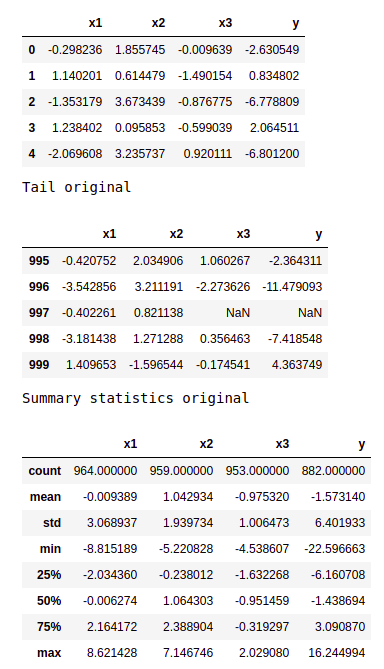
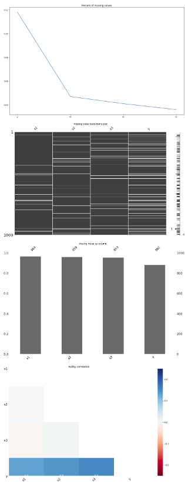
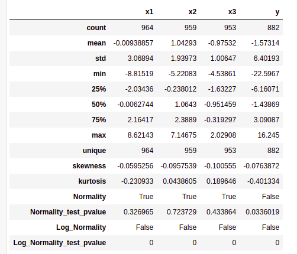
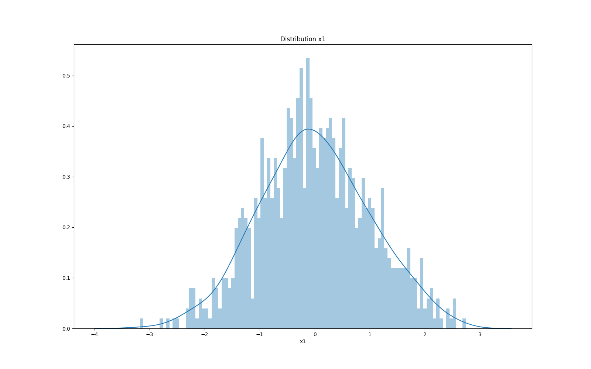
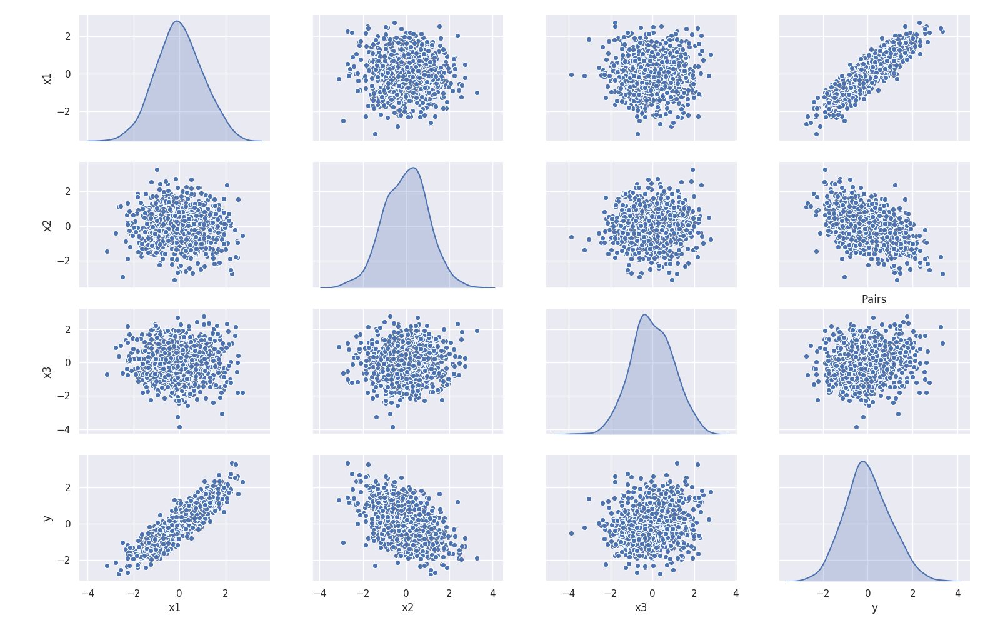
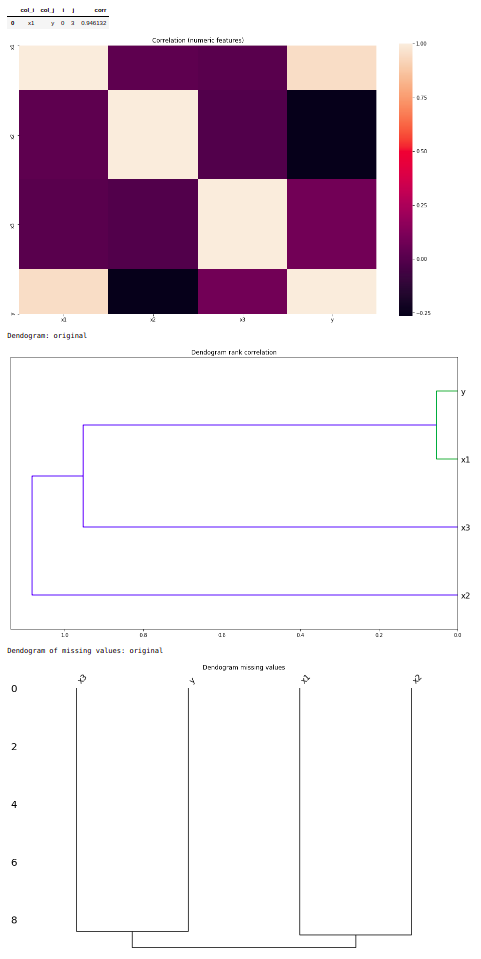

# Explore (df)

These steps implement data exploration when dataset is a DataFrame (i.e. `dataset_type: 'df'`).

The exploration step is run twice:

- Original (raw) dataset
- Pre-processed dataset

With both analysis you can check whether the pre-processing steps had the desired results, such as properly imputing missing values, or normalizing the data

All missing values are imputed on the pre-processed dataset, so any analysis related to missing values is only performed on the original (raw) dataset.


### Summary statistics

- Show DataFrame head and tail (firs and last lines)
- Summary statistics: count, mean, std, min, 25%, 50%, 75%, max



### Missing data analysis

- Number of missing values
- Plot: Percent of missing values
- Chart: DataFrame missingness
- Plot: Missing by column
- HeatMap: Missingness correlation



### Field description

- Field statistics
- Skewness, Kurtosis
- Normality test and p-value
- Log-Normality test and p-value
- Histogram and kernel density estimate




### Pair plots: scatter plot of variables pairs (up to `plot_pairs_max`, default 20)



### Correlation analysis

- Rank correlation (Spearsman)
- Top correlations, show correlation over `corr_thresdld` (default 0.7)
- Save top correlations as CSV file
- HeatMap
- Dendogram
- Dendogram of missing values



### Config YAML

These are the *config_YAML* options related to dataset exploration

```
dataset_explore:
  # Set to 'false' to disable this step
  enable: true

  # Perform correlation analysis
  is_correlation_analysis: true

  # Show dendogram
  is_dendogram: true

  # Describe all variables
  is_describe_all: true

  # Perform 'missing data' analysis
  is_nas: true

  # Plot pairs of variables
  is_plot_pairs: true

  # Create summary
  is_summary: true

  # Also explore 'original' dataset (i.e. before transforming)
  is_use_ori: false

  # Consider variables 'highly correlated' if over this threshold
  corr_thresdld: 0.7

  # Do not plot pairs if there are more than 'correlation_analysis_max' variables
  correlation_analysis_max: 100

  # When plotting a histogram, the columns should have at least this number of
  # unique values to show the 'kernel density estimate' line
  describe_kde_min_uniq_values: 100

  # Do not perform dendogram plot for more than 'dendogram_max' varaibles
  dendogram_max: 100

  # Do not plot pairs if there are more than 'plot_pairs_max' varaibles
  plot_pairs_max: 20

  # Consider a variable 'normal' or 'log normal' if Shapiro-Wilks test is over this threshold
  shapiro_wilks_threshold: 0.1
```
