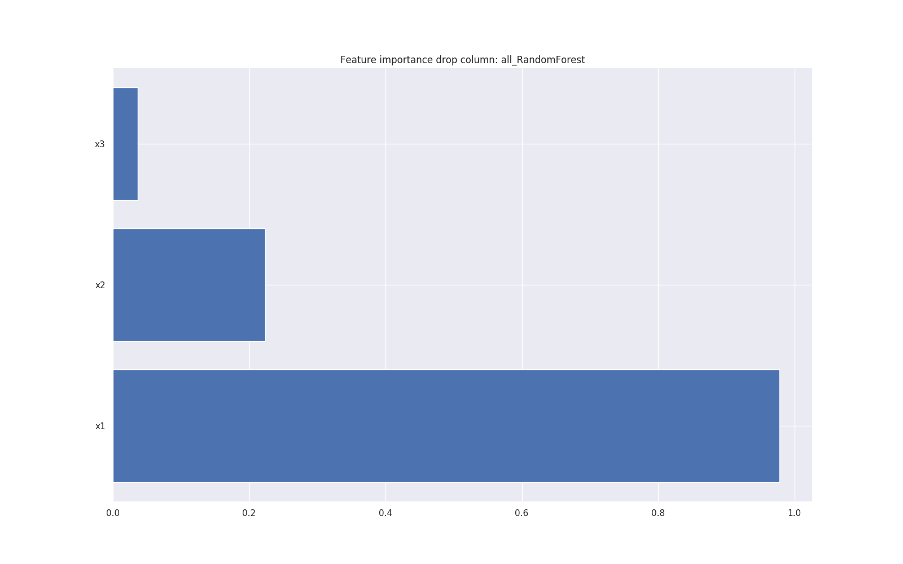

# Workflow: Feature importance

Feature importance tries to detemine which

These steps implement data exploration when dataset is a DataFrame (i.e. `dataset_type: 'df'`).

### Model-based column permutation
Estimate feature importance based on a model by randomly permuting values on each column.

How it works: Suffle a column and analyze how model performance is degraded. Most important features will make the model perform much worse when shuffled, unimportant features will not affect performance.

Models used (SciKit-Learn, default parameters):
- Random Forest
- ExtraTrees
- GradientBoosting


### Model-based drop-column

Estimate feature importance based on a model by dropping a column.

How it works: Drops a single column, re-train and analyze how model performance
is degraded (respect to validation dataset). Most important features will
make the model perform much worse when dropped, unimportant features will
not affect performance

Models used (SciKit-Learn, default parameters):
- Random Forest
- ExtraTrees
- GradientBoosting



### SkLearn importance

Use default SciKit-Learn importance estimation method.
Models: Random Forest, ExtraTrees, GradientBoosting (default parameters)

### Regularization models

Perform a model fir with regularization (using cross-validation), then analyze the model coefficients.

Models used (SciKit-Learn, default parameters):
- Lasso
- Ridge
- Lars (AIC)
- Lars (BIC)


### Selection

Use a SciKit-Learn `SelectFdr` or `SelectKBest`, depending on whether the selection function has p-values or not.

Selection function     | Has p-value | Classification / Regression
-----------------------|-------------|------------------
f_regression           | True        | Regression
mutual_info_regression | False       | Regression
f_classif              | True        | Classification
mutual_info_classif    | False       | Classification
chi^2                  | False       | Classification

### Recursive Feature Elimination

Use recursive feature elimination (SciKit-Learn `RFECV`) using several models:

Model            | Classification / Regression
-----------------|-----------------------------
Lasso            | Regression
Ridge            | Regression
Lars (AIC)       | Regression
Lars (BIC)       | Regression
Random Forest    | Classification, Regression
ExtraTrees       | Classification, Regression
GradientBoosting | Classification, Regression

In all cases, Scikit-Learn models with default parameters are used.

### Linear model p-value

Calculate p-value based on a linear model (`statsmodels.regression.linear_model.OLS`).
The null model variables can be set in the *config_YAML*, parameter `linear_pvalue_null_model_variables`.
P-values are corrected for multiple testing using False Discovery Rate (FDR).

### Logistic regression p-value

Calculate p-value based on a logistic regression model (Wilks theorem) (`statsmodels.discrete.discrete_model.Logit`).
The null model variables can be set in the *config_YAML*, parameter `logistic_regressions_by_class`
P-values are corrected for multiple testing using False Discovery Rate (FDR).

When the classification is non-binary (i.e. multiple classes), the p-values are calculated as one class compared to all others (for each class). Then p-values are FDR adjusted. Significance is assessed on any comparison.

### Tree graph

Create a shallow decision tree (default `tree_graph_max_depth=4`) and show a graph og the tree


# Weighted rank

All feature importance algorithm results are combined in a summary table.

Finally the results are ranked according to all methods:

- Model based methods are weighted according to the 'loss functions' from each model (on the validation set), i.e. lower is better. Losses (lower is better) are transformed to weights (higher is better) and corrected to be in the range `[weight_min, weight_max]` (defalt `[1, 10]`)
- Other methods use a weight of `weight_min` (default 1.0)
- Ranks from all algorithms are multiplied by the weights to form a weighted rank sum (`rank_sum` in the summary table)
- The `rank_sum` result is ranked, most important variables are shown first

variable | importance_permutation_RandomForest | ... | importance_dropcol_RandomForest | ... | ranks_sum          | rank_of_ranksum
---------|-------------------------------------|-----|---------------------------------|-----|--------------------|-----------------
x1       | 73.424                              | ... | 50.154                          | ... | 134.99             | 1.0
x2       | 16.635                              | ... | 11.455                          | ... | 269.99             | 2.0
x3       |  2.723                              | ... |  1.856                          | ... | 404.98             | 3.0


# Congig YAML

These are the *config_YAML* options related to feature importance

```
dataset_feature_importance:
  # Set to 'false' to disable this step
  enable: true

  # Set to 'false' to disable this step for 'na' dataset (i.e. a dataset of missing data)
  enable_na: true

  # Enable "Feature Importance using Permutations" (for different models)
  is_fip_random_forest: true
  is_fip_extra_trees: true
  is_fip_gradient_boosting: true

  # Regularization methods
  # Enable regularization methods (for different models)
  is_regularization_lasso: true
  is_regularization_ridge: true
  is_regularization_lars: true
  # Number of Cross-validation in regularization methods
  regularization_model_cv: 10

  # Enable Recursive Feature Elimination (for different models)
  is_rfe_model: true
  is_rfe_model_lasso: true
  is_rfe_model_ridge: true
  is_rfe_model_lars_aic: true
  is_rfe_model_lars_bic: true
  is_rfe_model_random_forest: true
  is_rfe_model_extra_trees: true
  is_rfe_model_gradient_boosting: true
  rfe_model_cv: 0  # Number of Corss-validations in Recursive Feature Elimination methods

  # Enable model selection methods (SelectFdr / SelectKBest)
  is_select: true

  # Linear regression p-value
  is_linear_pvalue: true
  # Variables used for setting the null model (always add to linear regression model)
  linear_pvalue_null_model_variables: ['x6']

  # Tree graph
  is_tree_graph: true
  tree_graph_max_depth: 4  # Number of layers to show in graph

  # Range to use when expanding weights
  # Note: Weights are converted to an interval [weight_min, weight_max]
  weight_max: 10.0
  weight_min: 1.0

  # Logistic regression p-value (Wilks)
  is_wilks: true
  # Variables used for setting the null model
  wilks_null_model_variables: ['age', 'sex', 'pc_1', 'pc_2', 'pc_3', 'pc_4']

```
