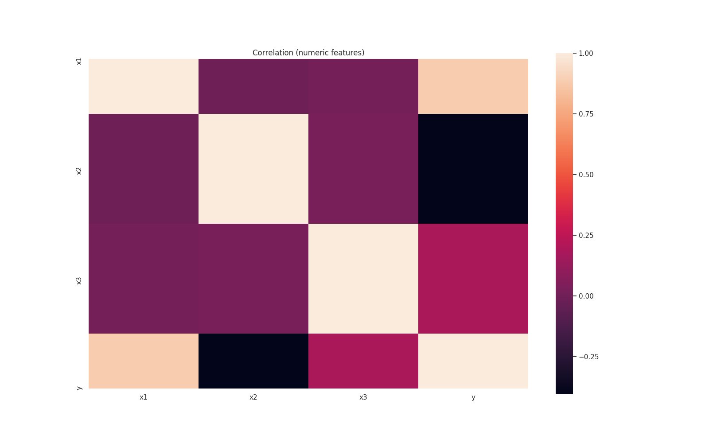
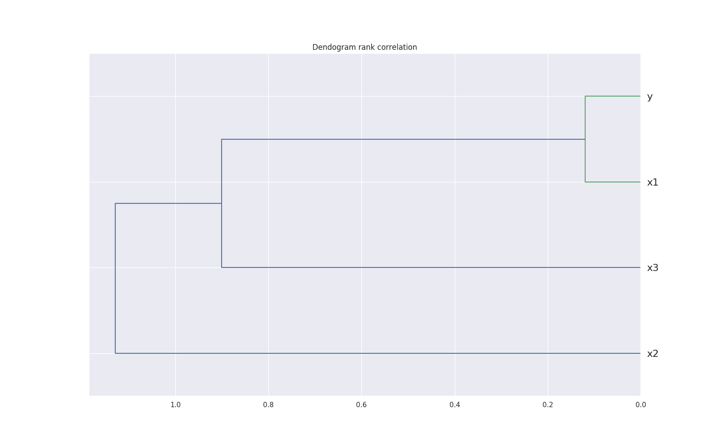
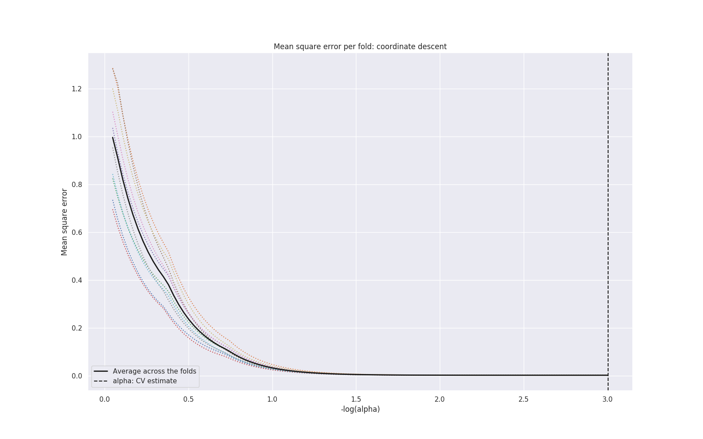
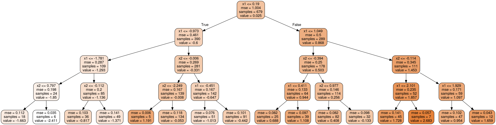

# Introduction

In this introduction, we show an example on how to run LogMl from the command line

## Running from command line

In order to run this example, you'll need to

1. Copy the dataset to your LogMl install directory
1. Copy the configuration file to your LogMl install directory
1. Run LogMl

### Set up environment variables

In the rest of the examples, we assume that the following variables are set to the corresponding directories:

```
# I checked out LogMl GitHub repository to $HOME/workspace/LogMl
# You need to change this variable accordingly
LOGML_SRC="$HOME/workspace/LogMl"

# I installed LogMl in the default directory: $HOME/logml
# You need to change this variable accordingly
LOGML_INSTALL="$HOME/logml"
```

### Copy dataset file

The dataset in this example consists of three normally distributed variables (`x1`, `x2`, `x3`) and some random noise (`n`), the output variable (`y`) is calculated as:
```
y = 2 * x1 - 1 * x2 + 0.5 * x3 + 0.1 * n
```
The file `data/intro/intro.csv` (from GitHub repository) is a CSV file with `1,000` samples from the above equation.

Copy the file to your `logml` directory
```
# Create data directory
cd $LOGML_INSTALL
mkdir -p data/intro

# Copy dataset file from the source directory.
cp $LOGML_SRC/data/intro/intro.csv data/intro/intro.csv
```

### Copy configuration file

The YAML configuraton file for this example, is in GitHub's repository `config/intro.yaml`, you can copy it to the `logml` directory

```
cd $LOGML_INSTALL
mkdir -p config
cp $LOGML_SRC/config/intro.yaml config/
```

### Running LogMl

To run LogMl, you just need to invoke LogMl with the propper configuration file

```
# Activate virtual environment
cd $LOGML_INSTALL
. ./bin/activate

# Run LogMl
./src/logml.py -c config/intro.yaml
```

# Results

The output includes:

## Results: Dataset exploration

### Show dataset (head & tail)

idx  | x1        | x2        | x3        |  y
-----|-----------|-----------|-----------|------------
1    |  0.977291 |  0.247040 |  0.272578 |  0.772232
2    |  1.261573 | -0.090584 | -0.386493 |  1.036706
3    |  0.442205 | -1.059191 |  0.877819 |  0.986426
4    | -1.353664 | -0.310002 |  1.697421 | -0.672185
5    |  0.744831 |  0.750820 |  0.754703 |  0.448015

### Variables statistics (including normally analysis)

variable                  |           x1
--------------------------|--------------
count                     |          853
mean                      |  1.77011e-17
std                       |      1.00059
min                       |     -3.17445
25%                       |    -0.689298
50%                       |   -0.0406822
75%                       |     0.663965
max                       |      2.74289
unique                    |          853
skewness                  |    0.0353077
kurtosis                  |    -0.192718
Normality                 |         True
Normality_test_pvalue     |     0.465024
Log_Normality             |        False
Log_Normality_test_pvalue |            0

### Variables distributions


### Pairs plots


### Correlation analysis



### Correlation dendogram



## Feature importance

### Feature importance: Model based

RandomForest, ExtraTrees, GradientBoosting. Using drop column and permutation analysis


### Feature importance: Regression models



### Feature importance: Tree desition graph



### Feature importance: Weighted rank sum of all methods

variable | importance_permutation_RandomForest | ... | importance_dropcol_RandomForest | ... | ranks_sum          | rank_of_ranksum
---------|-------------------------------------|-----|---------------------------------|-----|--------------------|-----------------
x1       | 73.424                              | ... | 50.154                          | ... | 134.99             | 1.0
x2       | 16.635                              | ... | 11.455                          | ... | 269.99             | 2.0
x3       |  2.723                              | ... |  1.856                          | ... | 404.98             | 3.0

##Model search

### Model search with hyper-parameter tuning

Summary of all models, ranked by validation performance

Model                                                                    |train                   |validation             |time
-------------------------------------------------------------------------|------------------------|-----------------------|---------------------
sklearn.linear_model.TheilSenRegressor.20200104.020150.141139.143        |0.0017                  |0.00144                |0.89
sklearn.linear_model.LassoCV.20200104.020155.308599.151                  |0.0017                  |0.00145                |0.05
sklearn.svm.LinearSVR.20200104.020005.137177.30                          |0.0017                  |0.00145                |0.02
sklearn.linear_model.ARDRegression.20200104.020005.196092.32             |0.0017                  |0.00146                |3.88
sklearn.linear_model.BayesianRidge.20200104.020004.916091.22             |0.0017                  |0.00146                |0.01
sklearn.linear_model.Lars.20200104.020510.961392.460                     |0.0017                  |0.00146                |0.00
sklearn.linear_model.LinearRegression.20200104.020006.495526.34          |0.0017                  |0.00146                |0.01
sklearn.linear_model.OrthogonalMatchingPursuit.20200104.020004.965360.24 |0.0017                  |0.00146                |0.01
sklearn.linear_model.RANSACRegressor.20200104.020155.257481.149          |0.0017                  |0.00146                |0.01
sklearn.linear_model.HuberRegressor.20200104.020155.202713.147           |0.0017                  |0.00147                |0.01
sklearn.ensemble.GradientBoostingRegressor.20200104.020331.408829.326    |0.0035                  |0.00698                |0.54
sklearn.ensemble.GradientBoostingRegressor.20200104.020333.410398.328    |0.0048                  |0.00781                |0.72
sklearn.ensemble.GradientBoostingRegressor.20200104.020337.272208.333    |0.0036                  |0.00841                |0.45
sklearn.linear_model.RidgeCV.20200104.020150.046718.139                  |0.0098                  |0.00926                |0.01
sklearn.ensemble.GradientBoostingRegressor.20200104.020309.050059.304    |0.0029                  |0.01083                |0.98
...
sklearn.ensemble.GradientBoostingRegressor.20200104.020251.214883.275    |1.0007                  |1.00914                |0.51
sklearn.linear_model.Lasso.20200104.020155.407230.153                    |1.0                     |1.01526                |0.00
sklearn.dummy.DummyRegressor.20200104.020004.830997.18                   |1.0                     |1.01526                |0.01
