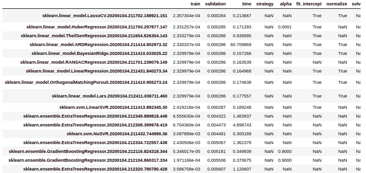

# Model Search

LogMl can perform model search, that is, fit many different models and rank them according to their (validation) performance.


Models used in model search (these models are based on SciKit-Learn):

1. sklearn.dummy.DummyClassifier
1. sklearn.dummy.DummyRegressor
1. sklearn.ensemble.AdaBoostClassifier
1. sklearn.ensemble.AdaBoostRegressor
1. sklearn.ensemble.BaggingClassifier
1. sklearn.ensemble.BaggingRegressor
1. sklearn.ensemble.ExtraTreesClassifier
1. sklearn.ensemble.ExtraTreesRegressor
1. sklearn.ensemble.GradientBoostingClassifier
1. sklearn.ensemble.GradientBoostingRegressor
1. sklearn.ensemble.HistGradientBoostingClassifier
1. sklearn.ensemble.HistGradientBoostingRegressor
1. sklearn.ensemble.RandomForestClassifier
1. sklearn.ensemble.RandomForestRegressor
1. sklearn.linear_model.ARDRegression
1. sklearn.linear_model.BayesianRidge
1. sklearn.linear_model.HuberRegressor
1. sklearn.linear_model.Lars
1. sklearn.linear_model.Lasso
1. sklearn.linear_model.LassoCV
1. sklearn.linear_model.LinearRegression
1. sklearn.linear_model.LogisticRegressionCV
1. sklearn.linear_model.OrthogonalMatchingPursuit
1. sklearn.linear_model.PassiveAggressiveClassifier
1. sklearn.linear_model.Perceptron
1. sklearn.linear_model.RANSACRegressor
1. sklearn.linear_model.Ridge
1. sklearn.linear_model.RidgeCV
1. sklearn.linear_model.TheilSenRegressor
1. sklearn.naive_bayes.BernoulliNB
1. sklearn.naive_bayes.ComplementNB
1. sklearn.naive_bayes.GaussianNB
1. sklearn.naive_bayes.MultinomialNB
1. sklearn.neighbors.KNeighborsClassifier
1. sklearn.neighbors.KNeighborsRegressor
1. sklearn.neighbors.NearestCentroid
1. sklearn.neighbors.RadiusNeighborsClassifier
1. sklearn.neighbors.RadiusNeighborsRegressor
1. sklearn.svm.LinearSVC
1. sklearn.svm.LinearSVR
1. sklearn.svm.NuSVC
1. sklearn.svm.NuSVR
1. sklearn.svm.SVC
1. sklearn.svm.SVR
1. sklearn.tree.DecisionTreeClassifier
1. sklearn.tree.DecisionTreeRegressor

Note that Dummy models are included. Dummy models are useful as a simple baseline to compare with other (real) models.


### Model Search with Hyper-parameter optimization:

Hyper-parameter optimization can be used in conjunction with model search for find a suitable set of hyper-parameters for each model.
These are the models currently using hyper-parameter optimization in model search.

1. sklearn.ensemble.ExtraTreesClassifier
1. sklearn.ensemble.ExtraTreesRegressor
1. sklearn.ensemble.GradientBoostingClassifier
1. sklearn.ensemble.GradientBoostingRegressor
1. sklearn.neighbors.KNeighborsClassifier
1. sklearn.neighbors.KNeighborsRegressor
1. sklearn.ensemble.RandomForestClassifier
1. sklearn.ensemble.RandomForestRegressor

### Results

Model search results are shown in a table, ranked by validation score.
The table also shows:
- train loss
- validation loss
- training time
- all hyper-parameters used to create the model (NA if the hyper-parameters does not apply to a specific model)



### Config_YAML


The *config_YAML* pard that refers to model search simply includes all model file YAMLs in a sub directory:

```
model_search:
  enable: true
  models: !include models_search/*.yaml
```

Each YAML file in the sub-directory `models_search` is a configuration for a specific model.
For instance, here is the configuration YAML for RandomForestRegressor, you can see how default parameter values and hyper parameter optimization:
```
RandomForestRegressor:
  functions:
    model_create:
      bootstrap: true
      criterion: mse
      max_features: auto
      min_impurity_decrease: 0.0
      min_samples_leaf: 1
      min_samples_split: 2
      min_weight_fraction_leaf: 0.0
      n_jobs: -1
      n_estimators: 100
      oob_score: false
      verbose: 0
      warm_start: false
  hyper_parameter_optimization:
    enable: true
    algorithm: tpe
    max_evals: 100
    show_progressbar: true
    space:
      model_create:
        max_depth:
          - uniformint
          - 2
          - 30
        max_features:
          - uniform
          - 0.3
          - 1.0
        min_samples_split:
          - uniformint
          - 2
          - 20
        min_samples_leaf:
          - uniformint
          - 1
          - 100
        n_estimators:
          - uniformint
          - 2
          - 1000
  model:
    model_class: sklearn.ensemble.RandomForestRegressor
    model_type: regression
```
